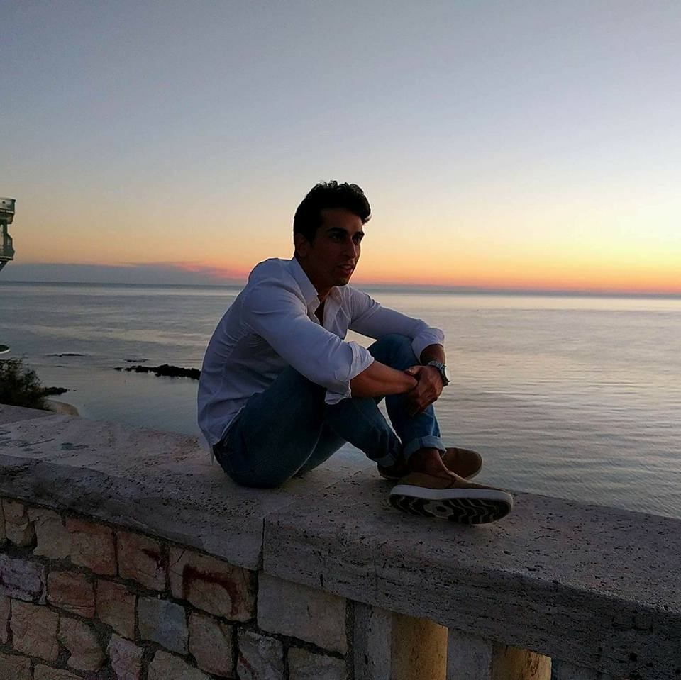

  

- Data Engineer who likes to learn and create   
- [Piano](https://matteoromiti.github.io/piano-journey/) (and former violin) student who likes [classical and electronic](https://github.com/alegaballo/Tools/blob/master/playlist_creator/sorted_tracks.csv) music  
- Former [CouchSurfer](https://www.couchsurfing.com/people/matteoromiti) who likes [plants](https://matteoromiti.github.io/blog/Plants-Stuff/)   
- [Reader](https://matteoromiti.github.io/reading-list/) who enjoys Matt Levine's Newsletter  
- Former [volleyball player](https://youtu.be/ljKnFh7Vxms) who likes [skateboards and snowboards](https://youtu.be/X3y-hf4Nu7k)  
- Italian who likes to cook and eat well

> "Many small people, in many small places, do many small things, that can alter the face of the world."

